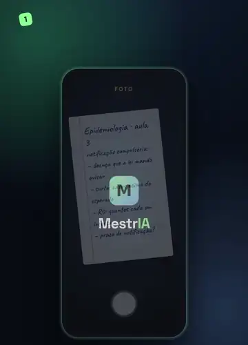

<picture>
  <source media="(max-width: 700px) and (prefers-color-scheme: dark)" srcset="assets/terminal-celular-escuro.svg">
  <source media="(max-width: 700px)" srcset="assets/terminal-celular-claro.svg">
  <source media="(prefers-color-scheme: dark)" srcset="assets/terminal-escuro.svg">
  <source media="(prefers-color-scheme: light)" srcset="assets/terminal-claro.svg">
  
</picture>

### Oi, eu sou o Thulio 👋

Estou construindo a **[MestrIA](https://vagalume.xyz)**: você tira foto da matéria e a IA monta **resumo, flashcards e quiz**. 
Com a **MestrIA Proof**, a sua meta de estudo vira um compromisso na **Solana**: depois de assinar, ninguém muda.

Building MestrIA: an AI study app where your study goal becomes an on-chain commitment on Solana (Devnet).

  

  

**[Testar o app](https://vagalume.xyz/app)** · **[Conhecer a MestrIA](https://vagalume.xyz)**

